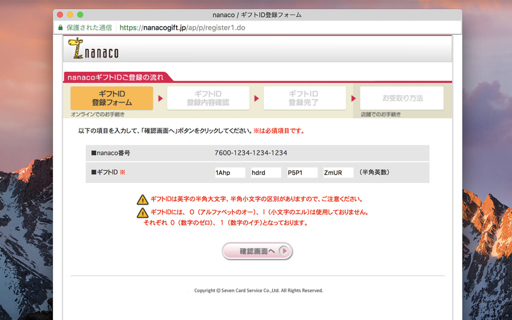

# nanaco gift code input helper

nanacoギフトコードの入力を少し楽にします

https://chrome.google.com/webstore/detail/nanaco-gift-code-input-he/eekphfelaedkocmngpodmoahbgbldbik



- nanacoギフトコード登録画面で、ギフトID欄に16桁いっぺんにコピーペーストできるようになります。
- ギフトIDの前後に関係ない文字列 (有効期限、ホワイトスペースやラベルなど) が含まれていても、ギフトID部分を自動的に抽出します。
- コード入力後のボタン操作を自動化します。

## Security

[Content Security Policy](https://developer.chrome.com/extensions/contentSecurityPolicy) により、外部ホストとの通信を禁止しています (入力したギフトコードを外部に送出することはありません) 。

## build

ビルド済みバイナリは [Chrome Web Store で公開](https://chrome.google.com/webstore/detail/nanaco-gift-code-input-he/eekphfelaedkocmngpodmoahbgbldbik) していますが、自分でビルドすることもできます。

npm と Chrome (拡張機能のデベロッパーモードを有効にする) が必要です。

```sh
# 依存パッケージのインストール
npm install

# コンパイル (ソース変更を監視して自動コンパイル)
npm run dev:chrome

# パッケージ化
npm run build:chrome
```

`dist/chrome` ディレクトリを Chrome の "パッケージ化されていない拡張機能を読み込む..." 機能で指定することで、ローカルで実行できます。

## License

MIT License
